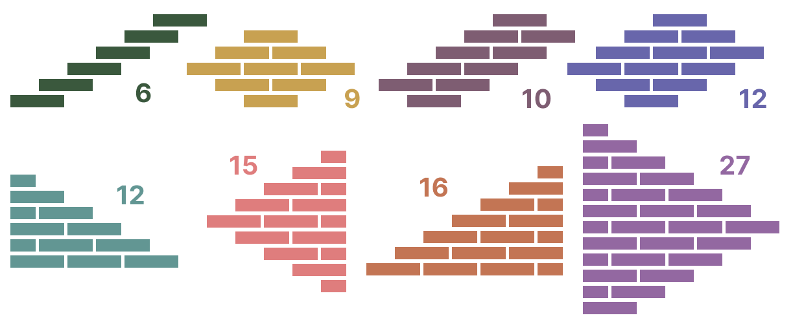

# Interactive Simulator for Robotic Masonry Wall Construction

This project simulates masonry wall construction for robotic manipulators using various bond patterns. The simulator provides **visualization** and **optimized build planning** under real-world constraints typical for automated masonry systems.

---

## Features

- Supports multiple bond patterns:
  - **Stretcher Bond**
  - **English Bond**
  - **Wild Bond (controlled random bond with pattern constraints)**
- **Optimized build order algorithm**:
  - Minimizes manipulator permutations (position changes).
  - Maximizes efficient build volume within one take.
- Interactive wall plan visualization.
- Customizable wall dimensions and stride parameters.
- Written in **Python 3.11**.

---

## Installation & Usage

### Prerequisites

- Python 3.11 or higher
- Git
- Tcl/Tk: Tkinter is required for visualization.

### Installation

```bash
git clone https://github.com/Arina100808/MasonryWallSimulator
cd MasonryWallSimulator
```

Create a virtual environment if needed and ensure all dependencies are installed.

- On macOS/Linux:
```bash
python3 -m venv venv
source venv/bin/activate
```

- On Windows:
```bash
python3 -m venv venv
venv\Scripts\activate
```

Install the required packages:

```bash
pip install -r requirements.txt
```

### Special Note: Tkinter Installation
Tkinter is used for visualization.

Check whether Tkinter is working:
```bash
python3 -m tkinter
```

You should see a small Tkinter window appear. If it works, you can proceed to the _Running the Simulator_ step.

If you encounter an error like `ModuleNotFoundError: No module named 'tkinter'`, install Tkinter manually:
- On Linux (Debian/Ubuntu):
  ```bash
  sudo apt-get install python3-tk
  ```
- On macOS:
  ```bash
  brew install python-tk
  ```

Finally, verify Tkinter is working:
```bash
python3 -m tkinter
```

You should see a small Tkinter window appear.

If the issue persists for macOS, try [this](https://rinblog.org/en/python-tkinter-module-not-found-mac-en/).

### Running the Simulator

```bash
python3 builder.py --stride-width 800 --stride-height 1300 --bond stretcher 
```

Note: if the visualization window is cut off on your screen, decrease the `--scale` parameter.

During simulation, press `Enter` to place the next brick. To build the entire wall, keep pressing `Enter` until completion.

### Available Command-Line Arguments

| Argument          | Type   | Default   | Description                             | Possible Values                                                    |
|-------------------|--------|-----------|-----------------------------------------|--------------------------------------------------------------------|
| --bond            | str    | stretcher | Type of bond pattern                    | stretcher, english, wild                                           |
| --stride-width    | float  | None      | Stride width in mm for optimized build  | Any positive float                                                 |
| --stride-height   | float  | None      | Stride height in mm for optimized build | Any positive float                                                 |
| --scale           | float  | 0.3       | Visualization scale factor              | Any positive float                                                 |
| --width           | float  | 2300.0    | Wall width in mm                        | Positive float* >= `brick_length + head_joint + half_brick_length` |
| --height          | float  | 2000.0    | Wall height in mm                       | Positive float* >= `brick_height + bed_joint`                      |
| --brick-length    | float  | 210.0     | Brick length in mm                      | Any positive float                                                 |
| --brick-width     | float  | 100.0     | Brick width (thickness) in mm           | Any positive float                                                 |
| --brick-height    | float  | 50.0      | Brick height in mm                      | Any positive float                                                 |
| --head-joint      | float  | 10.0      | Vertical head joint thickness in mm     | Any non-negative float                                             |
| --bed-joint       | float  | 12.5      | Horizontal bed joint thickness in mm    | Any non-negative float                                             |
| --debug           | flag   | False     | Enable debug mode                       | (just add --debug flag)                                            |

***Additional restrictions:**
- `width - brick_half_length` must be a multiple of `brick_length`;
- `height` must be a multiple of `brick_height + bed_joint`.

`brick_half_length` is calculated as `(brick_length - head_joint) / 2` to ensure proper alignment of half-bricks.

---

## Algorithm Overview

The manipulator works in "strides"—rectangular blocks consisting of the set of bricks that can be built at once.
- If stride dimensions are provided, the optimized build order is used. Otherwise, a simple bottom-to-top, left-to-right order is applied.
- The robot builds strides using a snake pattern both within each stride and across strides.

### Optimization Criteria

This algorithm aims to minimize the number of manipulator permutations instead of minimizing total travel distance. Fewer permutations reduce idle time and increase efficiency, lowering both build time and labor costs.

### Assumptions
- The wall has no vertical joints along its side edges.
- The lowest course begins with a brick resting on a bed joint, meaning the wall starts with a joint at the bottom and has no joint at the top.
- The stride width measurement includes the head joint of the last brick in that stride (except for the edges of the wall).
- A brick can only be placed when fully supported by underlying bricks ⇔ no "floating bricks" ("falling teeth" patterns) or unsupported patterns are allowed.

## Approach to Solving the Problem

During algorithm development, various geometric configurations were analyzed to achieve maximum efficiency within stride constraints. Example figures showing possible shapes and their brick counts are shown below (for default parameters).



### Triangle-based Filling

The largest shape possible is a triangle ⇒ the goal is to maximize the number of triangles filled in a wall.
- The algorithm first builds a base for the wall consisting of:
  - two triangular sections on both edges (figures containing 12 and 16 bricks in the image above), and
  - a central stride between them, creating a stable foundation and enabling a more efficient brick-laying pattern in the center.
- Then, the bricks that can form large triangles are defined and "reserved" (figures with 15 and 27 bricks in the example).
- After triangles are calculated, the center area is filled. For this step, the shape that can be filled with the maximum number of bricks is selected (figure with 12 bricks), considering that triangles are unavailable at this step.
- When the center area is filled, the triangles are built.
- This process repeats until the wall is complete.

### Constraints

- For Wild Bond:
  - Courses are offset by ¼ of a brick.
  - No more than 5 consecutive full bricks are allowed.
  - No consecutive half-bricks are allowed.
  - No more than 4 consecutive "staggered steps" or "falling teeth" patterns are allowed.
  - Within-row limitations (for the number of consecutive full and half bricks) have higher priority if conflicts occur. Because of the conflicts, the maximum number of consecutive unwanted patterns among rows was decreased from 6 to 4.

---

## Object-Oriented Structure

- `BaseWall`: Common functionality shared across all wall types.
- `StretcherBondWall`, `EnglishBondWall`, `WildBondWall`: Specific implementations of each bond type.
- `BondLayoutHelper`: Shared logic for odd-even row generation.
- `Brick`: Represents a single brick with its dimensions and position.

---

## Limitations

- Figures for triangle filling were selected manually; other combinations may yield better efficiency.
- Topmost courses may leave partially filled strides that could be merged for improved performance.
- Brick placement search can be optimized using indexed data structures.

---

## Possible Future Work

- Improve adaptation for other bond types.
- Implement stride merging logic, especially near the wall top.
- Optimize data storage using dictionaries or spatial indices.
- Enhance the row generation algorithm for wild bond patterns to better resolve conflicts arising from multiple consecutive brick placement restrictions.
- Explore _reinforcement learning_ approaches for generating optimal build sequences.
q
---

## Algorithm Visualization

Video demos of the different bond patterns are available [here](https://drive.google.com/drive/folders/1en7e6gEa-pvXH3F2jea14407Z-MVdxEz?usp=sharing) and below.

### Stretcher Bond


### English Bond


### Wild Bond

